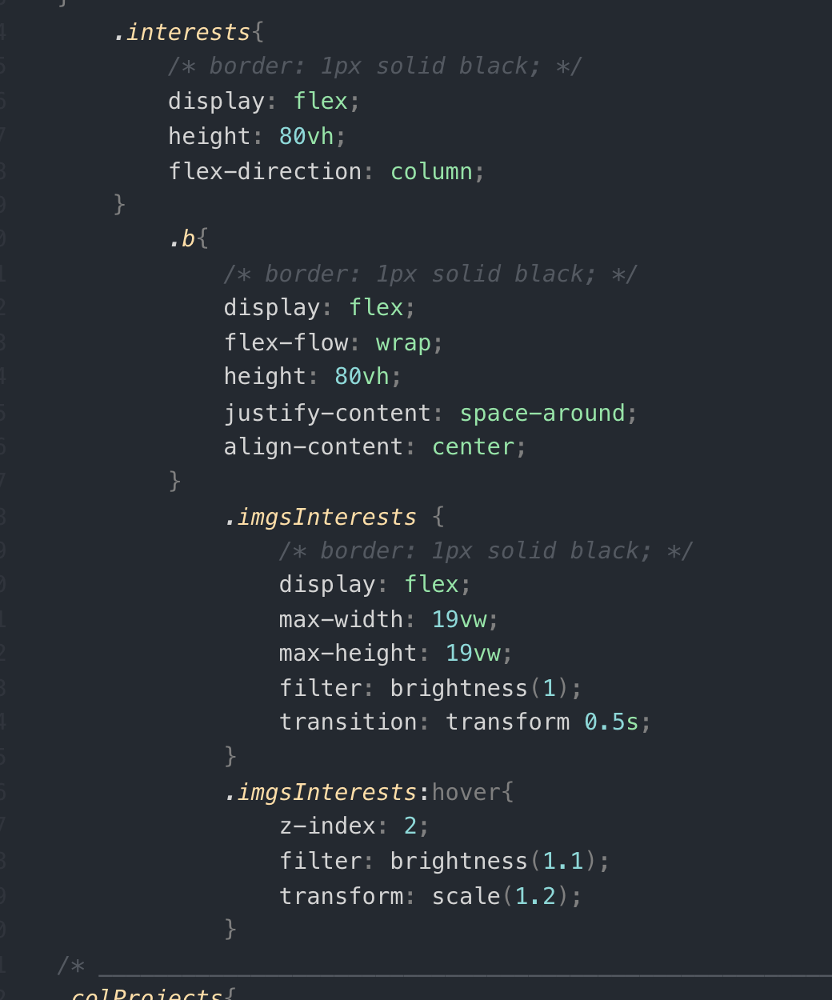

# josephhrohman.github.io
About Me Website

Technologies used:
    - Pen & Paper
    - Computer
    - MDN / W3 / Stackflow for references
    - A few google image searches for design inspiration
    - GA Github Lessons
    - HTML, CSS, JS
Your process/approach:
    - I first thought about what categories would be good to feature in an 'about me' website: contact, about/story, interests, etc.
    - I did a 6 - panel wireframe to flush out these sections and think of creative ways to display them.
Unsolved problems:
    - While I was able to use a few animations, I would have liked to make my carosel actually slide.  I did wait until the last minute to complete this aspect because I got wrapped up in the other sections, styling, and design.
    - OnClick of the nav will toggle the background color of 'Interests' however would lock the background color of the other elements with the background color.  Using the same code and different variables.
Your biggest wins and challenges:
    - Biggest Challenge
        - Tiiiiime management
        - Sticking to one design
        - Planning may be one of the most important things, but flushing out every detail before starting is probably not the greatest move
    - Biggest Win
        - I now have a much better grasp of flexbox - I'm able to predict what is going to happen before testing
        - My javascript (while not dry in the slightest) I was able to write quickly and was certain that it would proabbly do what I wanted it to.

Screenshot:

